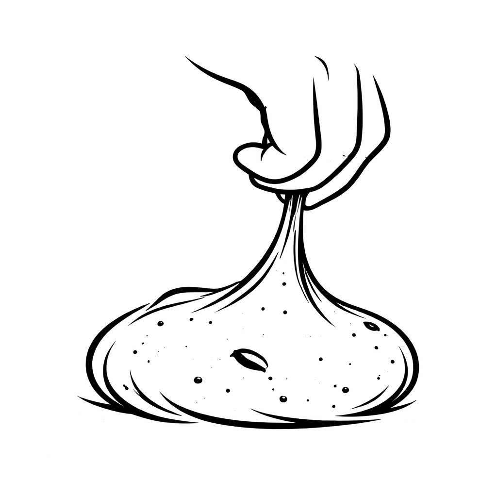

<html lang="it">
<head>
<meta charset="UTF-8">
<meta name="viewport" content="width=device-width, initial-scale=1.0">

</head>

<body>

    

        
    

    <h2>Componi il tuo lievitato</h2>

    <label>Impasto</label>
    <select id="impasto"></select>

    <label>Sospensioni (puoi selezionarne più di una)</label>
    <select id="sospensioni" multiple size="5"></select>

    <label>Glassa</label>
    <select id="glassa"></select>

    <label>Decorazione</label>
    <select id="decorazione"></select>

    <button onclick="genera()">Genera ingredienti</button>

    

</body>
</html>
